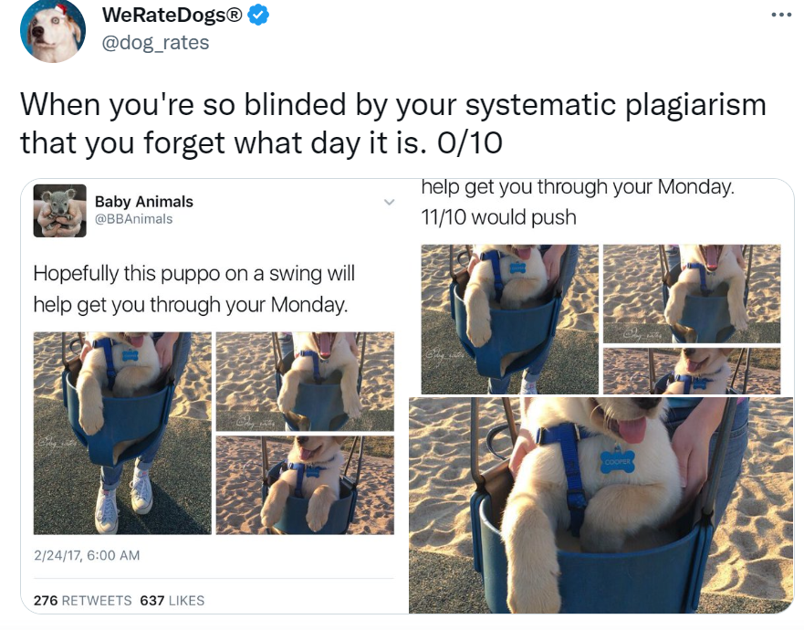

# Data-Wrangling---WeRateDogs-Twitter-Archive

Gathering, cleaning, and analysing Twitter Archive Data.

 

## Introduction
In this project I will be gathering, assessing, cleaning and analysing data from the WeRateDogs Twitter archive data. WeRateDogs is a Twitter account with over 4 million followers that rates people's dogs with humurous captions. WeRateDogs has a unique rating system. The rating denominators are almost always 10 while the numerators are almost always greater than 10 i.e. 11/10, 12/10, 13/10 because ["they're good dogs Brent"](https://knowyourmeme.com/memes/theyre-good-dogs-brent). 

#### Project Overview
The project will follow these steps:
1. Gathering
2. Assessment
3. Cleaning 
4. Storing Cleaned Data
5. Analysis and Visualisation of Data
6. Reporting

### Project Environment

I used Python 3.8.8 for this project and Juptyer Notebook as an IDE. Then main packages are as follows: **pandas, numpy, requests, os, json, tweepy and matplotlib.pyplot**. I also used additonal packages such as **seaborn** and **skimage** for further analysis and visualisation. 
   

### Data
* ['twitter-archive-enhanced.csv'](twitter-archive-enhanced.csv): the enhanced archive data provided by Udacity, which contains extra columns for dog stages.
* ['image-predictions.tsv'](image-predictions.tsv): image predictions that were compiled after the archive data was run through a neural network that can classify dog breeds.
* ['tweet-json.txt'](tweet-json.txt): a json text file gathered from Twitter's API.
* ['twitter_archive_master.csv'](twitter_archive_master.csv): a master dataset created from merging the above 3 after assessment and cleaning, and to be used for analysis and visualisation.

### Reports

* [wrangle_act.ipynb](wrangle_act.ipynb): this is where all the code for wrangling and analysis is executed.
* [wrangle_report](wrangle_report.pdf): this is a summary of the steps I took to assess, clean and store the data.
* [act_report.pdf](act_report.pdf): this is includes insights and visualisations from the analysis.

## Author

Gorata Malose
[Linkedin: Gorata Malose](https://www.linkedin.com/in/gorata-bridget-malose/)

## License

This project is licensed under the [MIT](MIT-LICENSE.txt) License and it was submitted by Gorata Malose as part of Udacity's Data Analyst Nanodegree programme.
